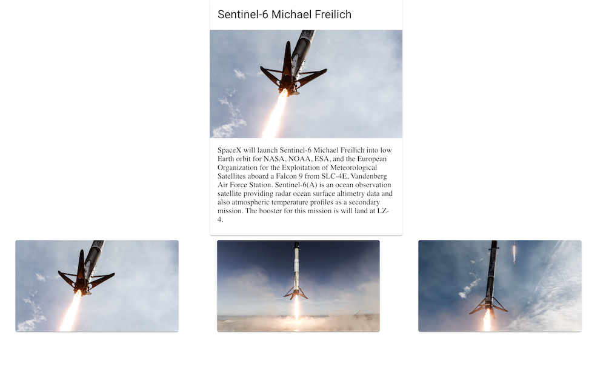

# GraphQL Demo with SpaceX API

This project was bootstrapped with [Create React App](https://github.com/facebook/create-react-app).
Inspired by fireship.io tutorial on graphql with Angular

##Mission
Create a React app with a list of past SpaceX launches together with a detail page. Data is fectched from [SpaceX GraphQL API](https://api.spacex.land/graphql/). GraphQL schema is generated by [graphql-code-generator](https://github.com/dotansimha/graphql-code-generator)

## End Result
#### List View

#### Detail View

## Available Scripts

In the project directory, you can run:

### `yarn start`

Runs the app in the development mode.\
Open [http://localhost:3000](http://localhost:3000) to view it in the browser.

The page will reload if you make edits.\
You will also see any lint errors in the console.

### `yarn codegen`
Runs graphql-codegen for the graphql queries located in `src/graphql/*.graphql` and produced schema for the queries.
Currently generated schema is available in `src/graphql/grahql.tsx`

## Reference
GraphQL Basics - https://www.youtube.com/watch?v=7wzR4Ig5pTI
SpaceX API Explorer - https://api.spacex.land/graphql/
Apollo react graphql - https://www.apollographql.com/docs/react/get-started/
React-Typescript-GraphQL - https://www.youtube.com/watch?v=zmzZwZh77_w
